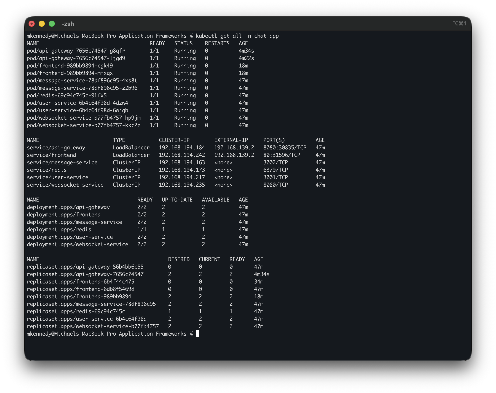

# Chat Application - Microservices on Kubernetes

A real-time chat application transformed from a monolithic architecture to microservices, deployed on Kubernetes (OrbStack).

---

## 📦 **Assignment Deliverables**

**🎯 [VIEW ALL DELIVERABLES](DELIVERABLES.md)** - Complete list of assignment requirements and artifacts

### Quick Links to Key Deliverables:

| Deliverable | Location | Description |
|-------------|----------|-------------|
| 📐 **Architecture Documentation** | [`docs/ARCHITECTURE.md`](docs/ARCHITECTURE.md) | Before/After architecture with diagrams, service breakdown, comparison |
| 📸 **Screenshots** | [`screenshots/`](screenshots/) | Kubernetes deployment status & running application |
| ☸️ **Kubernetes YAMLs** | [`k8s/`](k8s/) | All deployment and service manifests |
| 💻 **Source Code** | Root directory | Complete microservices implementation |

### Screenshots Preview:

<details>
<summary>📸 Click to view screenshots</summary>

#### Kubernetes Deployment Status


#### Live Application with Real-time Chat


</details>

---

## Table of Contents

- [Overview](#overview)
- [Architecture](#architecture)
- [Prerequisites](#prerequisites)
- [Quick Start](#quick-start)
- [Detailed Deployment](#detailed-deployment)
- [Accessing the Application](#accessing-the-application)
- [Monitoring](#monitoring)
- [Troubleshooting](#troubleshooting)
- [Cleanup](#cleanup)

## Overview

This project demonstrates the transformation of a monolithic chat application into a microservices-based architecture deployed on Kubernetes. The application provides real-time messaging capabilities using WebSockets, with services broken down for scalability and maintainability.

### Key Features

- Real-time bidirectional communication via WebSockets
- Microservices architecture with 5 independent services
- Horizontal scaling with multiple replicas
- Redis-based pub/sub for WebSocket coordination
- Kubernetes deployment with health checks and auto-restart
- Load balancing across service replicas
- Persistent message and user storage

## Architecture

### Microservices

1. **Frontend Service** (React + Nginx)
   - Serves the React application
   - 2 replicas, LoadBalancer service

2. **API Gateway** (Node.js + Express)
   - Routes HTTP/WebSocket traffic
   - Rate limiting and CORS handling
   - 2 replicas, LoadBalancer service

3. **WebSocket Service** (Node.js + ws)
   - Manages WebSocket connections
   - Redis pub/sub for multi-instance coordination
   - 2 replicas, ClusterIP service

4. **User Service** (Node.js + Express)
   - Manages user presence and sessions
   - 2 replicas, ClusterIP service

5. **Message Service** (Node.js + Express)
   - Handles message persistence and retrieval
   - 2 replicas, ClusterIP service

6. **Redis** (Redis 7 Alpine)
   - Pub/sub messaging
   - Data persistence
   - 1 replica, ClusterIP service

For detailed architecture documentation, see [ARCHITECTURE.md](docs/ARCHITECTURE.md).

## Prerequisites

### Required Software

- **Docker Desktop** or **OrbStack** (recommended for Mac)
  - Download: https://orbstack.dev/
  - Includes Kubernetes support

- **kubectl** (Kubernetes CLI)
  ```bash
  # Install on macOS
  brew install kubectl

  # Verify installation
  kubectl version --client
  ```

- **Git**
  ```bash
  # Install on macOS
  brew install git
  ```

### System Requirements

- macOS (for OrbStack)
- 4GB RAM minimum (8GB recommended)
- 10GB free disk space

### Enable Kubernetes in OrbStack

1. Open OrbStack
2. Go to Settings → Kubernetes
3. Enable "Kubernetes Cluster"
4. Wait for cluster to start
5. Verify: `kubectl cluster-info`

## Quick Start

For a fast deployment:

```bash
# Clone the repository
cd k8s-microservices

# Build all Docker images
./build.sh

# Deploy to Kubernetes
./deploy.sh

# Wait for deployment to complete (auto-handled by deploy.sh)

# Get the Frontend URL
kubectl get svc frontend -n chat-app

# Access the application in your browser
# Use the EXTERNAL-IP from the command above
```

## Detailed Deployment

### Step 1: Build Docker Images

Build all microservice Docker images:

```bash
./build.sh
```

This will build:
- `chat-frontend:latest`
- `chat-api-gateway:latest`
- `chat-websocket-service:latest`
- `chat-user-service:latest`
- `chat-message-service:latest`

Verify images:
```bash
docker images | grep chat-
```

### Step 2: Deploy to Kubernetes

Deploy all services:

```bash
./deploy.sh
```

This script will:
1. Create the `chat-app` namespace
2. Deploy Redis
3. Deploy backend services (User, Message, WebSocket)
4. Deploy API Gateway
5. Deploy Frontend
6. Wait for all pods to be ready

### Step 3: Verify Deployment

Check all resources:
```bash
kubectl get all -n chat-app
```

Expected output:
```
NAME                                     READY   STATUS    RESTARTS   AGE
pod/api-gateway-xxxxxxxxxx-xxxxx         1/1     Running   0          2m
pod/api-gateway-xxxxxxxxxx-xxxxx         1/1     Running   0          2m
pod/frontend-xxxxxxxxxx-xxxxx            1/1     Running   0          2m
pod/frontend-xxxxxxxxxx-xxxxx            1/1     Running   0          2m
pod/message-service-xxxxxxxxxx-xxxxx     1/1     Running   0          2m
pod/message-service-xxxxxxxxxx-xxxxx     1/1     Running   0          2m
pod/redis-xxxxxxxxxx-xxxxx               1/1     Running   0          2m
pod/user-service-xxxxxxxxxx-xxxxx        1/1     Running   0          2m
pod/user-service-xxxxxxxxxx-xxxxx        1/1     Running   0          2m
pod/websocket-service-xxxxxxxxxx-xxxxx   1/1     Running   0          2m
pod/websocket-service-xxxxxxxxxx-xxxxx   1/1     Running   0          2m

NAME                        TYPE           CLUSTER-IP      EXTERNAL-IP   PORT(S)
service/api-gateway         LoadBalancer   10.x.x.x        localhost     8080:xxxxx/TCP
service/frontend            LoadBalancer   10.x.x.x        localhost     80:xxxxx/TCP
service/message-service     ClusterIP      10.x.x.x        <none>        3002/TCP
service/redis               ClusterIP      10.x.x.x        <none>        6379/TCP
service/user-service        ClusterIP      10.x.x.x        <none>        3001/TCP
service/websocket-service   ClusterIP      10.x.x.x        <none>        8080/TCP
```

### Step 4: Check Pod Health

Verify all pods are running:
```bash
kubectl get pods -n chat-app
```

Check logs for any service:
```bash
# Frontend
kubectl logs -f deployment/frontend -n chat-app

# API Gateway
kubectl logs -f deployment/api-gateway -n chat-app

# WebSocket Service
kubectl logs -f deployment/websocket-service -n chat-app

# User Service
kubectl logs -f deployment/user-service -n chat-app

# Message Service
kubectl logs -f deployment/message-service -n chat-app

# Redis
kubectl logs -f deployment/redis -n chat-app
```

## Accessing the Application

### Get Service URLs

```bash
# Get Frontend URL
kubectl get svc frontend -n chat-app

# Get API Gateway URL
kubectl get svc api-gateway -n chat-app
```

With OrbStack, the EXTERNAL-IP will typically be `localhost`.

### Access the Chat Application

1. Open your browser
2. Navigate to: `http://localhost` (or the Frontend EXTERNAL-IP)
3. Enter a username
4. Click "Join Chat"
5. Start chatting!

### Test Multi-User Chat

1. Open the application in multiple browser windows/tabs
2. Join with different usernames
3. Send messages from any window
4. Verify messages appear in all windows in real-time

### API Gateway Endpoints

The API Gateway is accessible at `http://localhost:8080`:

```bash
# Health check
curl http://localhost:8080/health

# API info
curl http://localhost:8080/api/info

# Get online users
curl http://localhost:8080/api/users

# Get messages
curl http://localhost:8080/api/messages?limit=20
```

## Monitoring

### Check Service Health

All services expose a `/health` endpoint:

```bash
# API Gateway health
kubectl exec -n chat-app deployment/api-gateway -- wget -qO- http://localhost:8080/health

# User Service health
kubectl exec -n chat-app deployment/user-service -- wget -qO- http://localhost:3001/health

# Message Service health
kubectl exec -n chat-app deployment/message-service -- wget -qO- http://localhost:3002/health

# WebSocket Service health
kubectl exec -n chat-app deployment/websocket-service -- wget -qO- http://localhost:8080/health
```

### View Metrics

```bash
# WebSocket connections
kubectl exec -n chat-app deployment/websocket-service -- wget -qO- http://localhost:8080/metrics

# User count
curl http://localhost:8080/api/users/count

# Message count
curl http://localhost:8080/api/messages/count
```

### Watch Pods

Monitor pod status in real-time:
```bash
kubectl get pods -n chat-app -w
```

### View Events

Check cluster events:
```bash
kubectl get events -n chat-app --sort-by='.lastTimestamp'
```

### Describe Resources

Get detailed information about a resource:
```bash
kubectl describe pod <pod-name> -n chat-app
kubectl describe deployment <deployment-name> -n chat-app
kubectl describe service <service-name> -n chat-app
```

## Troubleshooting

### Pods Not Starting

Check pod status:
```bash
kubectl get pods -n chat-app
```

Describe the pod:
```bash
kubectl describe pod <pod-name> -n chat-app
```

Check logs:
```bash
kubectl logs <pod-name> -n chat-app
```

### Service Not Accessible

Check service:
```bash
kubectl get svc -n chat-app
kubectl describe svc <service-name> -n chat-app
```

Check endpoints:
```bash
kubectl get endpoints -n chat-app
```

### WebSocket Connection Failed

1. Check API Gateway logs:
   ```bash
   kubectl logs -f deployment/api-gateway -n chat-app
   ```

2. Check WebSocket Service logs:
   ```bash
   kubectl logs -f deployment/websocket-service -n chat-app
   ```

3. Verify Redis is running:
   ```bash
   kubectl get pods -n chat-app -l app=redis
   ```

### Redis Connection Issues

Check Redis logs:
```bash
kubectl logs -f deployment/redis -n chat-app
```

Verify Redis service:
```bash
kubectl get svc redis -n chat-app
```

Test Redis connection from a service:
```bash
kubectl exec -n chat-app deployment/user-service -- nc -zv redis 6379
```

### Image Pull Errors

If you see `ImagePullBackOff`:

1. Verify images are built:
   ```bash
   docker images | grep chat-
   ```

2. Rebuild images:
   ```bash
   ./build.sh
   ```

3. Check imagePullPolicy in YAML (should be `Never` for local images)

### Port Conflicts

If ports are already in use:

1. Check what's using the port:
   ```bash
   lsof -i :80
   lsof -i :8080
   ```

2. Stop conflicting services or change ports in YAML files

### Restart a Service

```bash
kubectl rollout restart deployment/<deployment-name> -n chat-app
```

### Delete and Redeploy

```bash
# Delete specific deployment
kubectl delete deployment <deployment-name> -n chat-app

# Redeploy
kubectl apply -f k8s/<service>.yaml
```

## Cleanup

### Remove All Resources

```bash
./cleanup.sh
```

This will:
1. Delete all deployments
2. Delete all services
3. Delete the namespace

### Verify Cleanup

```bash
kubectl get all -n chat-app
# Should return: No resources found
```

### Manual Cleanup

If the script fails, manually delete:

```bash
# Delete namespace (this deletes everything in it)
kubectl delete namespace chat-app

# Verify
kubectl get namespaces
```

### Remove Docker Images

```bash
docker rmi chat-frontend:latest
docker rmi chat-api-gateway:latest
docker rmi chat-websocket-service:latest
docker rmi chat-user-service:latest
docker rmi chat-message-service:latest
```

## Project Structure

```
k8s-microservices/
├── frontend/                  # React frontend service
│   ├── src/
│   ├── public/
│   ├── Dockerfile
│   ├── nginx.conf
│   └── package.json
├── api-gateway/               # API Gateway service
│   ├── server.js
│   ├── Dockerfile
│   └── package.json
├── websocket-service/         # WebSocket service
│   ├── server.js
│   ├── Dockerfile
│   └── package.json
├── user-service/              # User management service
│   ├── server.js
│   ├── Dockerfile
│   └── package.json
├── message-service/           # Message persistence service
│   ├── server.js
│   ├── Dockerfile
│   └── package.json
├── k8s/                       # Kubernetes manifests
│   ├── namespace.yaml
│   ├── redis.yaml
│   ├── user-service.yaml
│   ├── message-service.yaml
│   ├── websocket-service.yaml
│   ├── api-gateway.yaml
│   └── frontend.yaml
├── docs/                      # Documentation
│   └── ARCHITECTURE.md
├── build.sh                   # Build script
├── deploy.sh                  # Deployment script
├── cleanup.sh                 # Cleanup script
└── README.md                  # This file
```

## Advanced Usage

### Scale Services

Scale any service:
```bash
# Scale WebSocket service to 3 replicas
kubectl scale deployment websocket-service --replicas=3 -n chat-app

# Scale User service to 4 replicas
kubectl scale deployment user-service --replicas=4 -n chat-app
```

### Update a Service

1. Modify the service code
2. Rebuild the image:
   ```bash
   docker build -t chat-<service>:latest ./<service>
   ```
3. Restart the deployment:
   ```bash
   kubectl rollout restart deployment/<service> -n chat-app
   ```

### View Resource Usage

```bash
kubectl top pods -n chat-app
kubectl top nodes
```

### Port Forward (for debugging)

Forward a service port to localhost:
```bash
kubectl port-forward -n chat-app deployment/user-service 3001:3001
```

Then access at: `http://localhost:3001`

### Execute Commands in Pod

```bash
kubectl exec -it -n chat-app deployment/user-service -- /bin/sh
```

## Performance Testing

Test the application with multiple users:

```bash
# Open multiple browser windows/tabs
# Join with different usernames
# Send messages simultaneously
# Monitor logs:
kubectl logs -f deployment/websocket-service -n chat-app
```

## Security Notes

- Services communicate over internal ClusterIP network
- Only Frontend and API Gateway are exposed externally
- Redis is not accessible from outside the cluster
- Rate limiting enabled at API Gateway (100 req/15min per IP)

## Future Enhancements

- [ ] Add authentication/authorization service
- [ ] Implement JWT token-based auth
- [ ] Add TLS/SSL termination
- [ ] Implement Kubernetes Ingress
- [ ] Add persistent volumes for Redis
- [ ] Implement CI/CD pipeline
- [ ] Add monitoring (Prometheus/Grafana)
- [ ] Add distributed tracing (Jaeger)
- [ ] Implement service mesh (Istio/Linkerd)
- [ ] Add API versioning
- [ ] Implement message encryption

## License

This project is created for educational purposes as part of CMPE 272 coursework at San Jose State University.

## Support

For issues or questions:
1. Check the [Troubleshooting](#troubleshooting) section
2. Review logs: `kubectl logs -f deployment/<service-name> -n chat-app`
3. Check pod status: `kubectl describe pod <pod-name> -n chat-app`

## Author

Created for CMPE 272 - Enterprise Application Development
Fall 2025 - San Jose State University
